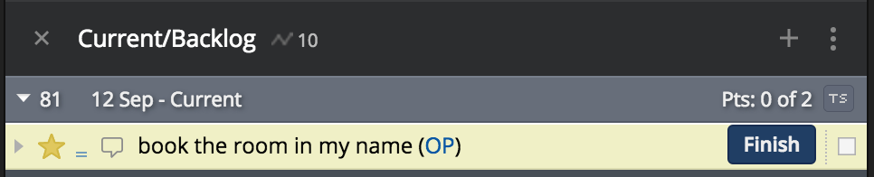
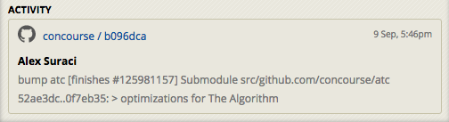

# Inflight

[](https://badge.fury.io/gh/odlp%2Finflight)
[](https://travis-ci.org/odlp/inflight)
[](https://coveralls.io/github/odlp/inflight?branch=master)

Inflight finds the ID of your currently started Pivotal Tracker story and adds it to your commit message. The story is located using the Git author's email.

Given you've started a story:



When you're ready to commit:

```sh
git commit
```

The story ID is ready and waiting in your commit message:

```

# Please enter the commit message for your changes. Lines starting
# with '#' will be ignored, and an empty message aborts the commit.
# On branch master
# Changes to be committed:
#       new file:   <% some changes %>
#

[#89688392]

```

## Background

Pivotal Tracker & Github allow you to easily [link commits to your tracker stories](http://www.pivotaltracker.com/blog/guide-githubs-service-hook-tracker/). When you craft a commit message like this:

```
My words of wisdom

[#<story-id>]
```

You'll see this commit linked in the activity of your story:




## Installation

1. [Download the latest release](https://github.com/odlp/inflight/releases) and place the binary on your path, e.g. `/usr/local/bin/inflight`

    Alternatively if you have Go installed, run:

    ```sh
    go get github.com/odlp/inflight
    ```

2. `cd` to the repo you'd like to configure.

3. Create a Git prepare commit message hook:

    ```sh
    touch .git/hooks/prepare-commit-msg
    ```

4. Edit the hook:

    ```sh
    #!/bin/bash

    export TRACKER_API_TOKEN="<your-tracker-api-token>"
    export TRACKER_PROJECT_ID="<your-tracker-project-id>"
    inflight -o "$1"
    ```

5. Make the hook executable:

    ```sh
    chmod +x .git/hooks/prepare-commit-msg
    ```

## Caveats

- The Git author's email must match the email used for Pivotal Tracker

## Todo

- Add interactive git hook setup
- Cache the author's Tracker initials to make the hook faster (fewer requests)
