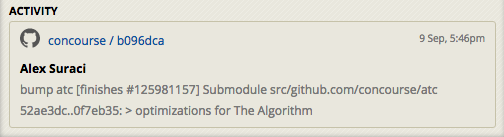

# Inflight

Inflight finds the ID of your currently started Pivotal Tracker story and adds it to your commit message. The story is located using the Git author's email.

## Background

Pivotal Tracker & Github allow you to easily [link commits to your tracker stories](http://www.pivotaltracker.com/blog/guide-githubs-service-hook-tracker/). When you craft a commit message like this:

```
My words of wisdom

[#<story-id>]
```

You'll see this commit linked in the activity of your story:




## Installation

1. Install via `go get`:

    ```sh
    go get github.com/odlp/inflight
    ```

2. `cd` to the repo you'd like to configure.

3. Create a prepare commit message hook:

    ```sh
    touch .git/hooks/prepare-commit-msg
    ```

4. Edit the hook:

    ```sh
    #!/bin/bash

    export TRACKER_API_TOKEN="<your-tracker-api-token>"
    export TRACKER_PROJECT_ID="<your-tracker-project-id>"
    inflight -o "$1"
    ```

5. Make it executable:

    ```sh
    chmod +x .git/hooks/prepare-commit-msg
    ```

## Todo

- Add interactive git hook setup
- Be graceful and don't prevent commits if an error occurs. E.g.
    - The user has no started stories
    - The API is down or keys are misconfigured
- Cache the author's Tracker initials to make the hook faster (fewer requests)
